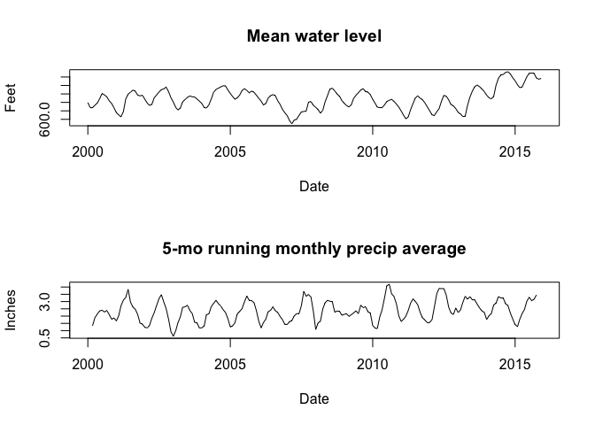
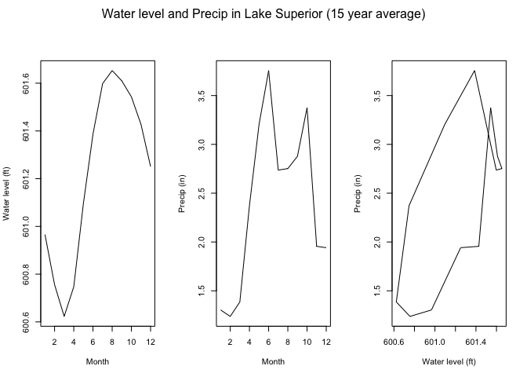
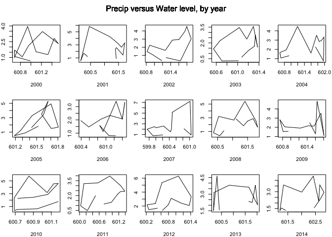
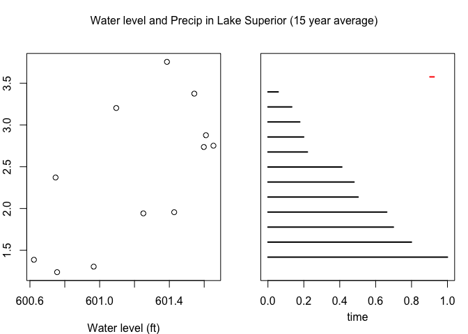
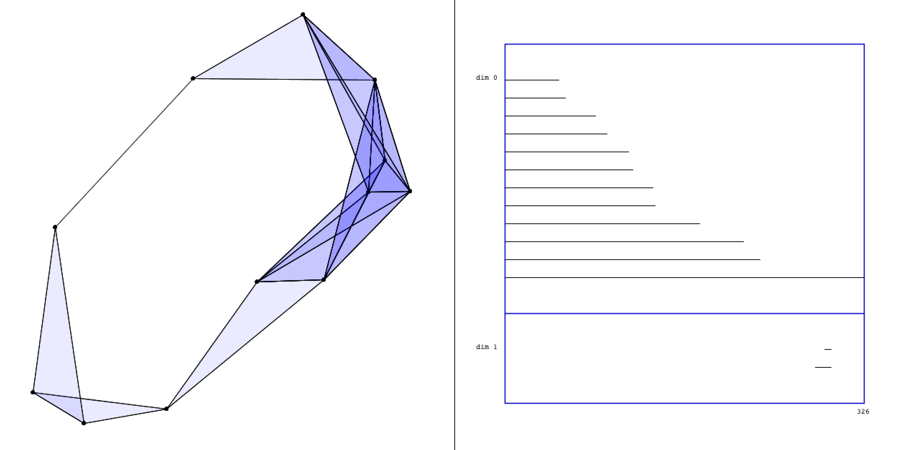

# Lake Superior water level and rainfall have non-trivial homology
Luke Wolcott  

### Abstract

We look at monthly precipitation levels of Lake Superior, and water level measurements at Marquette, MI.  These out-of-phase oscillations result in a phase diagram with a one-dimensional circle.  We use a topological data analysis package, TDA, to compute the persistent homology and barcode for this data, and detect the circle.

## Introduction

Our purpose is to use real data to give an example of topological data analysis, specifically persistent homology.  By looking at the relationships between points of a data set on a range of scales, topological data analysis allows us to find the "shape of the data".  In the simple example of a two-dimensional cloud of points, we have two tests: the zeroth homology H0 counts the number of components, and the first homology H1 counts the number of circles.

Our example aims to be as simple as possible, and to illustrate reproducibly the pipeline from data to insight.  We will find a circle in the data of rainfall and water level of Lake Superior.

## Data source and preprocessing

Here we describe the data sources and code used to clean the data.  The raw (pre-processed) data files are also available on our Github page.

### Water level

Our measurements of Lake Superior water level are at Marquette, MI, and come from the NOAA.  We use the monthly means from January 2000 through December 2015.  Specifically, the data set is downloaded from this page:

http://tidesandcurrents.noaa.gov/waterlevels.html?id=9099018&units=standard&bdate=20000105&edate=20151201&timezone=GMT&datum=IGLD&interval=m&action=

at this link:

http://tidesandcurrents.noaa.gov/api/datagetter?product=monthly_mean&application=NOS.COOPS.TAC.WL&station=9099018&begin_date=20000105&end_date=20151201&datum=IGLD&units=english&time_zone=GMT&format=csv

We assume the csv file is names "waterlevel.csv" and put in the working directory.  The file is loaded and minimally cleaned using the following.


```r
wl <- read.csv("waterlevel.csv", header=TRUE)
wl[,2] <- as.character(wl[,2])
wl$Year <- paste(wl$Year, wl$Month, sep=", ")
wl$Month <- NULL
names(wl)[1] <- "Date"
wl$Date <- strptime(paste(wl$Date, "1"), "%Y,%m %d")
wl <- wl[,c(1,5)]
```

In this data frame wl there are 192 rows; one for each month of the 16 years 2000-2015.  There are two columns: "Date" and "MSL", which measures the monthly mean water level in feet above mean sea level.

### Precipitation

We measure the Lake Superior water level at Marquette, but gather monthly precipitation levels from around the lake.  Using the NOAA Climate Data Online link:

http://www.ncdc.noaa.gov/cdo-web/search?datasetid=GHCNDMS

and selecting for Monthly Summaries between 1/1/2000 and 12/1/2015 in the Lake Superior Hydrological Unit (HUC:04020300), we can order a custom monthly CSV summary of total precipitation (TPCP; in inches).  We assume the file (also available on our GitHub page) is saved in the working directory as "precip_ls.csv".

When we load the data, we see it comes from seven weather stations.  Of the 192 possible monthly precipitation measurements, some are missing.


```r
precip <- read.csv("precip_ls.csv", header = TRUE, stringsAsFactors = FALSE)
table(precip$STATION_NAME)
```

```
## 
##  BEAVER BAY 5 SW MN US     GRAND MARAIS MN US  MADELINE ISLAND WI US 
##                    109                    187                    192 
## MOTT IS ISLE ROYALE US   MUNSING LAKESHORE US  ONTONAGON 8 WSW MI US 
##                     41                    133                     62 
##            SUPERIOR US 
##                    189
```

For each month, we average over the stations reporting precipitation that month.  


```r
dates <- unique(precip$DATE)
dates <- sort(dates)
TP <- 1:192
for (i in 1:192)
{
      TP[i] <- mean(subset(precip, DATE==dates[i])$TPCP)
}
pp <- data.frame(cbind(dates, TP))
pp$dates <- strptime(pp$dates, "%Y%m%d")
names(pp)[1] <- "Date" 
```

Now we have a data frame pp with 192 rows of months and two columns: "Date" and "TP", which gives the average precipitation for that month over Lake Superior.  We also create columns that compute the three-month and five-month running averages for precipitation.


```r
# compute 3-month running average in column pave3
pp$pave3 <- NA
for (i in 2:191)
      pp$pave3[i] = mean(c(pp$TP[i-1], pp$TP[i], pp$TP[i+1]))

# compute 5-month running average in column pave5
pp$pave5 <- NA
for (i in 3:190)
      pp$pave5[i] = mean(c(pp$TP[i-2],pp$TP[i-1], pp$TP[i], pp$TP[i+1],pp$TP[i+2]))
```

## Out-of-phase oscillations create circles

The general idea here is that both rainfall and water level will oscillate throughout the year, but they will be out-of-phase.  It takes time for the rain to make it into the lake.  When rainfall is peak, water level will be rising.  If water level is at a peak and beginning to decline, rain has already let off.  And so on.

The following plot shows these annual oscillations clearly.  Note that we plot the 5-month running average of precipitation.


```r
par(mfcol = c(2,1))
plot(wl$Date, wl$MSL, type="l", xlab = "Date", ylab = "Feet", main = "Mean water level")
plot(pp$Date, pp$pave5, type = "l", xlab = "Date", ylab = "Inches", main= "5-mo running monthly precip average")
```

 

To smooth out these oscillations further, we average over the 16 years with the following code.


```r
month <- 1:12
level <- 1:12
for (i in 0:11)
      level[i+1] <- mean(subset(wl, Date$mon == i)$MSL)
wl2 <- data.frame(cbind(month,level))

precip$DATE <- strptime(precip$DATE, "%Y%m%d")
TP <- 1:12
for (i in 0:11)
      TP[i+1] <- mean(subset(precip, DATE$mon == i)$TPCP)
pp2 <- data.frame(cbind(month, TP))
```

Finally, we are ready to see the circle that comes from the phase space of out-of-phase oscillations.  On the right we plot precipitation versus water level.


```r
par(mfcol=c(1,3),oma=c(0,0,2,0))
plot(wl2$month, wl2$level, type="l",xlab="Month",ylab="Water level (ft)")
plot(pp2$month, pp2$TP, type="l",xlab="Month",ylab="Precip (in)")
plot(wl2$level, pp2$TP, type="l", xlab="Water level (ft)", ylab="Precip (in)")
lines(wl2$level[c(1,12)],pp2$TP[c(1,12)])
mtext("Water level and Precip in Lake Superior (15 year average)", outer=TRUE)     
```

 

This circle is still somewhat apparent if we look year-by-year, but there is more noise.


```r
par(mfrow = c(3,5), mar=c(4,2,2,1), oma=c(0,0,2,0))
for(year in 2000:2014)
{
      start_mo = (year-2000)*12+1
      end_mo = (year-2000)*12+12
      plot(wl$MSL[start_mo:end_mo], pp$TP[start_mo:end_mo], type="l", xlab=as.character(year),ylab="")
      mtext("Precip versus Water level, by year", outer=TRUE)
}
```

 

## Circles have non-trivial homology

Now comes the topological data analysis.  This may or may not be a good place to explain what persistent homology and barcodes are, it is unclear.  There is now a topological data analysis package for R, called TDA.  We will input our circle data set into this machine, and show that it detects the circle.


```r
      library("TDA")
      par(mfcol=c(1,2),mar=c(4,2,2,1), oma=c(0,0,2,0))
      
      # circle data set
      plot(wl2$level, pp2$TP,  xlab="Water level (ft)", ylab="Precip (in)")
      
      # barcode
      maxscale <- 1
      maxdimension <- 1
      X <- cbind(wl2$level, pp2$TP)
      Diag <- ripsDiag(X = X, maxdimension, maxscale, library = "GUDHI", printProgress = FALSE)      
      plot(Diag[["diagram"]], barcode = TRUE)
      mtext("Water level and Precip in Lake Superior (15 year average)", outer=TRUE)
```

 

The barcode is on the right.  It reports the x-axis as "time", but really it is the filtration parameter of the Vietoris-Rips complex.  The TDA package uses black lines to indicate H0 intervals, and red lines for H1 intervals.  The small red line in the upper right corner tells us that the data set has an H1 in this interval of the filtration parameter.

Elsewhere we created an interactive TDA demo that computes barcodes and allows the user to add and remove points in realtime.  See our GitHub page for more information.  Here we include an image from that program, which draws in one state of the Vietoris-Rips complex and shows the H1 interval (below not above H0) more clearly.


